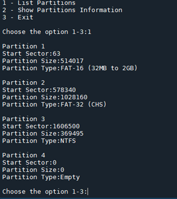
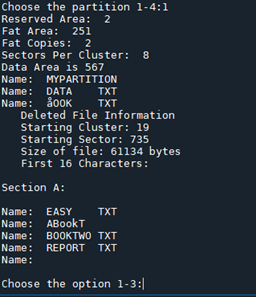

# Disk_Analyzer
Tool used for analysis of a raw disk image

**Using the program:**
-Python 3.6+ environment is required to run this program.  
(You can download the latest python version here https://www.python.org/downloads/) 

Once the environment is set-up the program can be executed in the following manner  
```python Disk_Analyzer.py “C:/’path to the disk image’/Sample.dd”```  
with the assumption that the disk name is “Sample.dd”  

In case there is no argument passed, the path will be defaulted to the one set in the program.

# Options Available
1 : "List Partitions"  
2 : "Show Partitions Information"  
3 : "Exit"  

# Partition Codes
0 - Empty  
1 - 12 bit FAT  
4 - 16 bit FAT  
5 - Ext MS-DOS Partition  
6 - FAT-16 (32MB to 2GB)  
7 - NTFS  
B - FAT-32 (CHS) >> Legacy  
C - FAT-32 (LBA)  
E - FAT-16 (LBA)  

# Variables
Adjust the **disktoRead** variable depending on the required sample size.

# Sample Output




